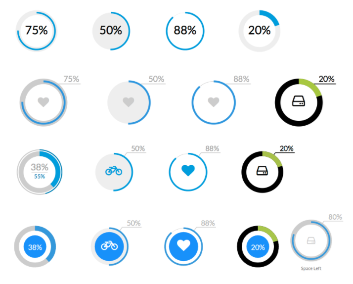

# Oracle APEX Region Type Plugin - Circliful Gauge

Region type plugin for displaying percentage values in responsive gauge charts.

## Documentation

Complete Document available on
[Circliful Gauge](http://apexfusion.blogspot.com/2017/05/oracle-apex-plugin-circliful-gauge.html "Circliful Gauge Homepage")

## Donate

## Changelog

#### 1.0 - Initial Release

## Install
- Import plugin file "region_type_plugin_com_planetapex_circliful_gauge.sql" from source directory into your application
- (Optional) Deploy the CSS/JS files from "src" directory on your webserver and change the "File Prefix" to webservers folder.

## Preview

## Demo Application
[Circliful Gauge Application](https://apex.oracle.com/pls/apex/f?p=83009:40 "Circliful Gauge Homepage")
